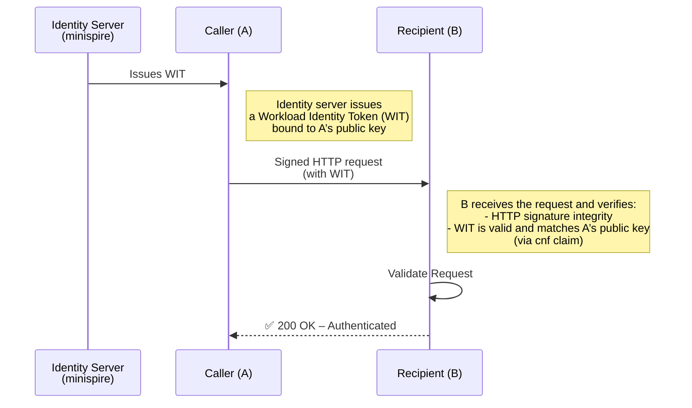

# Proof-of-concept demo of WIMSE S2S with HTTP Message Signatures

This is a proof-of-concept (POC) implementation of [WIMSE Service to Service Authentication](https://datatracker.ietf.org/doc/draft-ietf-wimse-s2s-protocol/) protocol [Option 2: Authentication Based on HTTP Message Signatures](https://www.ietf.org/archive/id/draft-ietf-wimse-s2s-protocol-07.html#name-option-2-authentication-bas). 

[HTTP Message Signature](https://datatracker.ietf.org/doc/rfc9421/) is an adopted IETF standard (RFC 9421) with a mechanism to create and verify signatures for specific components of an HTTP message, allowing for message integrity verification even when the full message isn't known to the signer or has been modified by intermediaries.

This POC utilises [minispire](https://github.com/cofide/minispire), a lightweight SPIFFE implementation that has been extended to issue [WIMSE Workload Identity Token (WIT)](https://www.ietf.org/archive/id/draft-ietf-wimse-s2s-protocol-07.html#name-the-workload-identity-token) SVIDs to a demo client and server. `minispire` provides a simple way to get workload identities issued without the need of a whole SPIRE setup, and implements an approximation of the in-development WIT-SVID currently under consideration in SPIRE.

In this example, we use WIMSE with HTTP Message Signatures to explore the use case of end-to-end authentication and signed messaging in the presence of a middlebox (e.g. L7 proxy). This is a use case often seen where using the more "traditional" mTLS approach is not feasible.

## How it works

```
                             ┌─────────────────┐
                             │                 │
      +----------------------│   minispire     │-------------+
      |                      │    Server       │             |             
      |                      │                 │             |            
      |                      └─────────────────┘             |            
      │ Issues WIT-                                          │ Issues WIT-
      │    SVID                                              │    SVID
      │              HTTP                                    │     
      ▼              request                                 ▼            
┌─────────────────┐  signed  ┌──────────────────┐     ┌─────────────────┐
│                 │  w. WIT  │                  │     │                 │
│  WIMSE-enabled  │─────────>│    Middlebox     │────>│  WIMSE-enabled  │
│  Client         │          │  (e.g., CDN/     │     │  Server         │
│                 │<─────────│   Cloudflare)    │<────│                 │
└─────────────────┘          │                  |     └─────────────────┘
                             │  Can inspect     │ HTTP response   
                             │  but not modify  │ signed w. WIT   
                             │  the signed data │     
                             └──────────────────┘     
``` 

A sequence diagram of the steps is provided:




## Running the demo

To run the demo you need to run a `cofide/minispire` server:
```
go run github.com/cofide/minispire/cmd@v0.2.2
```

Then in another terminal run the server:
```
go run ./examples/wimse-9421-server
```

At last run the client:
```
go run ./examples/wimse-9421-client
```

You will see the unmarshaled WIT of the client, its full request and subsequent response:
```
WIT header and payload:
{
  "alg": "ES256",
  "kid": "kid",
  "typ": "wit+jwt"
}{
  "aud": "",
  "cnf": {
    "jwk": {
      "alg": "ES256",
      "crv": "P-256",
      "kty": "EC",
      "use": "sig",
      "x": "XY5nlJAn3M6UVJk-kCUQj9EAGHS2v9rJDXbQ_WqvjkQ",
      "y": "v-gMoFmV65_HDmtim9q0rGkPDvk-eGSPdqLsFzhukMc"
    }
  },
  "exp": 1761818361,
  "iat": 1761818061,
  "iss": "wimse://example.com",
  "jti": "69055e02f3172df4efcf9fbd4ffa1080a7c1ef63d7c9776beaef0a3ed2950658",
  "sub": "wimse://example.com/bin/wimse-9421-client/gid/1000/pid/162557/uid/1000"
}

Request:
GET  HTTP/1.1
Workload-Identity-Token: eyJhbGciOiJFUzI1NiIsImtpZCI6ImtpZCIsInR5cCI6IndpdCtqd3QifQ.eyJhdWQiOiIiLCJjbmYiOnsiandrIjp7InVzZSI6InNpZyIsImt0eSI6Im9jdCIsImFsZyI6IkVTMjU2IiwiayI6Ik1Ga3dFd1lIS29aSXpqMENBUVlJS29aSXpqMERBUWNEUWdBRXU1bFRDdGZZeEN3YXZEejVzR2JhVUVXakFVamVLREpGdDkzemlCS0kyREhza1BuM0ZqcTdJWlMtUzlBLWwxSVB6cWtsYWRTVy13WWtwWDFMNmE5a3ZnIn19LCJleHAiOjE3NjE4MTgzNjEsImlhdCI6MTc2MTgxODA2MSwiaXNzIjoid2ltc2U6Ly9leGFtcGxlLmNvbSIsImp0aSI6IjY5MDU1ZTAyZjMxNzJkZjRlZmNmOWZiZDRmZmExMDgwYTdjMWVmNjNkN2M5Nzc2YmVhZWYwYTNlZDI5NTA2NTgiLCJzdWIiOiJzcGlmZmU6Ly9leGFtcGxlLmNvbS9iaW4vd2ltc2UtOTQyMS1jbGllbnQvZ2lkLzEwMDAvcGlkLzM4ODk4L3VpZC8xMDAwIn0.eaXvxpXYrXi0SWEt38R_jhXc_Hjfgt4UdhT1GMeWVU22mFk4iaKT638yIfHkYnGbYdK0u4sxDRPqm0ha_hvkpw
Signature: wimse=:uYOTjb4eKf2cBn4TyeViFtdZ8cfLZFhrGRw93XdWH/PlbsB182z3/RpeAaeKQuYepMpvxfjr+L2UG/VYv7ql8Q==:
Signature-Input: wimse=("@method" "@request-target" "workload-identity-token");created=1761818061;expires=1761818361;nonce="ce5ce6ca2cf748677c5198ffa72f2906a1e3f3eaaf9a8487eea551f2ca469ef0";alg="ecdsa-p256-sha256";tag="wimse-service-to-service"

Response:
HTTP/1.1 200 OK
Workload-Identity-Token: eyJhbGciOiJFUzI1NiIsImtpZCI6ImtpZCIsInR5cCI6IndpdCtqd3QifQ.eyJhdWQiOiIiLCJjbmYiOnsiandrIjp7InVzZSI6InNpZyIsImt0eSI6Im9jdCIsImFsZyI6IkVTMjU2IiwiayI6Ik1Ga3dFd1lIS29aSXpqMENBUVlJS29aSXpqMERBUWNEUWdBRXdWMlNoU1I3Z1Y1WmF1RmpiVDJkczFWLVZwaVdSZ1dfdmQ2T2pBamRiZ1VlS3NaT1gyai1Gdm9uSXB0RkNvLV9mS3ptMm5VMTQwQmdrY18xcGlyZ3dnIn19LCJleHAiOjE3NjE4MTgzNjEsImlhdCI6MTc2MTgxODA2MSwiaXNzIjoid2ltc2U6Ly9leGFtcGxlLmNvbSIsImp0aSI6ImMxNTA3ZjE5MmMyOTRiY2QzNmQ1YTU2Nzk3MzQ3NTUyMjY2MGZiZDdjNTA5YWE3YTFkOWJmYWExNDFlODliNGIiLCJzdWIiOiJzcGlmZmU6Ly9leGFtcGxlLmNvbS9iaW4vd2ltc2UtOTQyMS1zZXJ2ZXIvZ2lkLzEwMDAvcGlkLzE4NDIwL3VpZC8xMDAwIn0.zQE8GBbb-KwfdBf2in_OR-nwKVGtbcK4mSww5j1VFHRTM4-iVdqlIt6RURGEUijBt89PPaZuXPIL8pgeyUkqxw
Content-Digest: sha-256=:7JVJmgim6dP1haght1LWmS2hCitii6JgPiDrVLqTclw=:
Content-Length: 23
Content-Type: text/plain; charset=utf-8
Date: Thu, 30 Oct 2025 09:54:21 GMT
Signature: wimse=:YKMb/G/k0t9aTeqK//t7BD2P7uWW9Ph+E3SOqPRREFRn7vDu9keUkBlYPeWfMgmOoUZ8JYVzS2wn4z71XIcW+A==:
Signature-Input: wimse=("@status" "date" "workload-identity-token" "content-digest" "content-type" "content-length");created=1761818061;alg="ecdsa-p256-sha256";tag="wimse-service-to-service"
You are very WIMSEcal!
```

You can also run cURL against the server and see the error message:
```
curl -v http://localhost:8080/
```

## Running the demo with Cloudflare as "middlebox"

Follow the above instructions but when running the server.

We will also run cloudflared to proxy the requests to cloudflare's "TLS removed and added here" service:
```
docker run --net=host --rm cloudflare/cloudflared:latest tunnel --no-autoupdate --url "http://localhost:8080"
```

This will give you an `xxx.trycloudflare.com` URL (without account!).

You can then run the client against that URL:
```
go run ./examples/wimse-9421-client demo.go https://xxx.trycloudflare.com
```

You will notice Cloudflare modified the response adding its own headers but the signature on the headers and body we wanted to have signed is still valid and the client accepts the response. Guaranteeing us end to end integrity and authenticity of the message.
